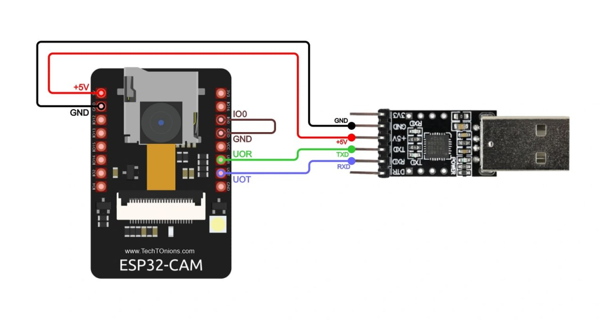

# uLisp User Manual

Корниенко Клим, ИУ7-61Б

Кузнецова Анастасия, ИУ7-61Б

Защита ЛР №6

# uLisp

uLisp - версия языка программирования Lisp, предназначенная для выполнения на микроконтроллерах с ограниченным количеством оперативной памяти.

список реализованных функций доступен по ссылке: http://www.ulisp.com/show?3L

# Подключение ESP-32 (Cam)

На рисунке представлена схема подключения ESP-32 Cam к USB-переходнику.



# Установка среды разработки

Для работы с ESP-32 необходимо установить среду разработки. В данном мануале используется расширение PlatformIO для VSCode.

После установки расширения необходимо создать проект, начальная конфигурация которого представлена на рисунке ниже.


Структура проекта:


# Установка uLisp

Для работы с uLisp на ESP32 необходимо скачать листинг (http://www.ulisp.com/list?4359), вставить код в `src/main.cpp` и загрузить на ESP-32. В процессе загрузки "Ctrl+Alt+U" может выдавать ошибку `function_name not defined in this scope` --- необходимо подключить заголовок <Arduino.h> и вставить заголовки функций с именами `function_name` в `// Forward references`, то есть в разделе комментария `// Forward references` должен быть следующий код:
```
object *tee;
void pfstring (PGM_P s, pfun_t pfun);
void pfl (pfun_t pfun);
void pserial (char c);
symbol_t sym (builtin_t x);
void psymbol (symbol_t name, pfun_t pfun);
void printobject (object *form, pfun_t pfun);
void errorend ();
inline void pln (pfun_t pfun);
void indent (uint8_t spaces, char ch, pfun_t pfun);
void printstring (object *form, pfun_t pfun);
object *intern (symbol_t name);
object *lispstring (char *s);
uint8_t nthchar (object *string, int n);
bool listp (object *x);
uint8_t getminmax (builtin_t name);
object *apply (builtin_t name, object *function, object *args, object *env);
intptr_t lookupfn (builtin_t name);
int listlength (builtin_t name, object *list);
void checkminmax (builtin_t name, int nargs);
object *eval (object *form, object *env);
void pint (int i, pfun_t pfun);
object *findpair (object *var, object *env);
char *lookupdoc (builtin_t name);
void printsymbol (object *form, pfun_t pfun);
object *tf_progn (object *args, object *env);
void testescape ();
int gserial ();
void pintbase (uint32_t i, uint8_t base, pfun_t pfun);
int subwidthlist (object *form, int w);
void supersub (object *form, int lm, int super, pfun_t pfun);
int gserial ();
object *fn_princtostring (object *args, object *env);
void prin1object (object *form, pfun_t pfun);
int glibrary ();
void plispstr (symbol_t name, pfun_t pfun);
object *read (gfun_t gfun);
void repl (object *env);
```

Если в процессе загрузки возникает ошибка `Could not open /dev/ttyUSB0, the port doesn't exist`, то нужно выполнить в терминале команду `chmod -R 777 /dev/ttyUSB0`.

В процессе загрузки во время того, когда на консоли будет выведено `Connecting...` необходимо нажать кнопку `Reset` на ESP32. После успешной загрузки необходимо убрать заземление `IO0` и снова нажать `Reset`.

uLisp загружен, взаимодействовать с ним можно в `Serial Monitor` (Ctrl+Alt+S). Пример взаимодействия представлен ниже.


